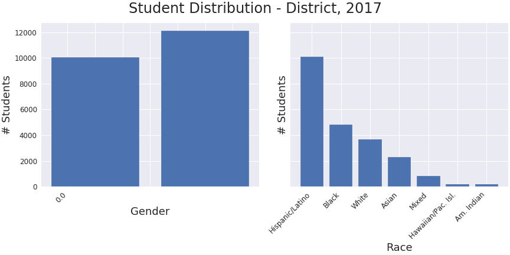
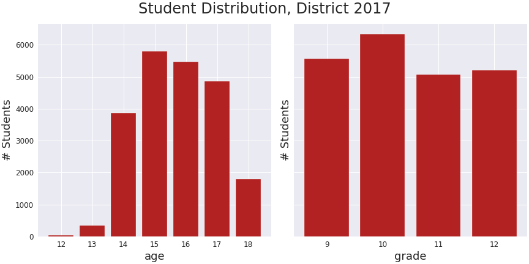

# Predicting Risk of Depression in Youth

  

## Motivation and Objective:

This project used machine learning models to predict youth behavior, specifically risk of 'considering suicide' and  (***MAYBE... TBD, PLACEHOLDER FOR NOW***) propensity for obesity as a function of various youth characteristics and other behavior. Models were derived from responses provided to a cross-sectional CDC survey on Youth Risk Behavior (YRBS). An interactive website was created using the best performing model to provide awareness on the topic to youth and their parents.

## Methods, Technologies, Packages & Libraries Used:

- Data cleaning 
- Exploratory Data Analysis
- Data Visualization

- Python, Jupyter Notebook
- Plotly, Matplotlib, Seaborn
- Pandas
- Scikit-learn:
  - Logistic Regression
  - K-Nearest Neighbors
  - Naive Bayes
  - Convolutional Neural Networks
  - Ensemble Learning Methods:
    - Random Forest (hyperparameter tuned using RandomizedSearchCV)
    - Gradient Boost Classifier (hyperparameter tuned using GridSearchCV)
    - Ada Boost Classifier
 
- Flask
- ... more (***TBD, PLACEHOLDER FOR NOW***)

## Data Preparation & EDA:

The CDC's biennial survey on youth risk behavior began in 1991 on the national, state and district levels. This project only uses survey responses from youths attending school and ranging in age from 12 to 18 years old during 2017. The data was obtained from the [CDC](https://www.cdc.gov/healthyyouth/data/yrbs/data.htm) as a Microsoft Access file, converted to a csv file and then pandas dataframe for data cleaning and preparation. The initial dataframe consisted of 357925 rows and 150 columns.

The more than 100 questions are categorized into:

- Demographics
- Height and Weight

and the following areas of risk:

- Unintentional Injuries and Violence
- Tobacco Use
- Electronic Vapor Product Use
- Alcohol and Other Drug Use
- Sexual Behaviors that Contribute to Unintended Pregnancy and Sexually 
  Transmitted Diseases (STDs), Including Human Immunodeficiency Virus (HIV)
  Infection
- Weight Management
- Dietary Behaviors
- Physical Inactivity
- HIV
- Other Topics

The primary target is whether or not the student "ever seriously considered attempting suicide" in the last 12 months. This binomial response question was codified such that Yes is 1 and No is 0.

The data contained a number of issues:
- questions from survey year 2017 were relatively inconsistent with prior survey years. Thus, only responses from 2017 were used
- the district data set contained 14 features (survey questions) with no responses. These features were removed
- duplicate and highly similar survey questions were considered duplicates and dropped
- all remaining features containing more than 10% of Nans were also removed
- all remaining categorical features were one-hot encoded
- additional steps to clean the data are addressed in the [clean_data helper function](src/helpers.py) 

Simple correlations and visualizations were made to gain a cursory understanding of the data.

  

There were slightly more female than male students (approximately 12000 to 10000, respectively) and there are more youths identifying as 'Hispanic/Latino' than 'Black' and 'White' identifying students combined. While students were equally distributed amongst the 9th, 10th, 11th and 12th grades, most of the students were between 15 to 17 years of age.

  

Pairwise correlation of the dataset shows there may be a correlation between the group of features in the lower right corner of the heatmap. These features include being cyber bullied, using electronic vapor products and the age in which the youh first used marijuana.

*** PLACEHOLDER ***

  

## Models:

A classifier was built using machine learning techniques and evaluated according to its precision, recall, receiver operating characteristics and a confusion matrix. 

Models to predict the probability a youth 'ever considered suicide' in the last year were made using logistic regression, k-nearest neighbors, naive bayes, random forest classification, gradient boost classification and ada boost classification. About 14 % of the respondents answered Yes to target variable, 'ever considered suicide', suggesting class imbalance exists in the dataset.

## TAKEAWAYS:

*** PLACEHOLDER *** ADD METRICS TABLE WITH MEH DATA

DISCUSS FEATURE ENGINEERING, TECHNIQUES TO CONSIDER CLASS IMBALANCE

COMPARE MODELS

ADD METRICS TABLE WITH SLIGHTLY LESS MEH DATA USING BEST MODEL. DISCUSS IMPROVEMENTS. 

DISCUSS FEATURE IMPORTANCE and DISCUSS ITS INCORPORATION INTO WEBSITE

ADD LINK TO WEBSITE!!!!!!!!  Need to finish making it first.

## Featured Notebooks/Analysis Files:
