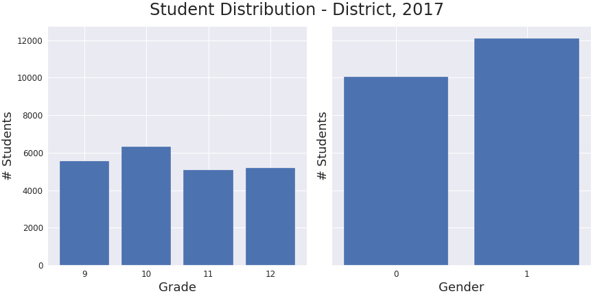
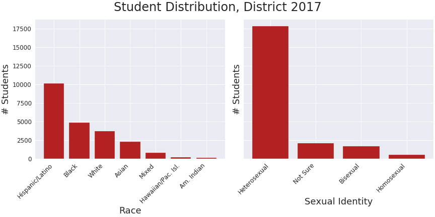
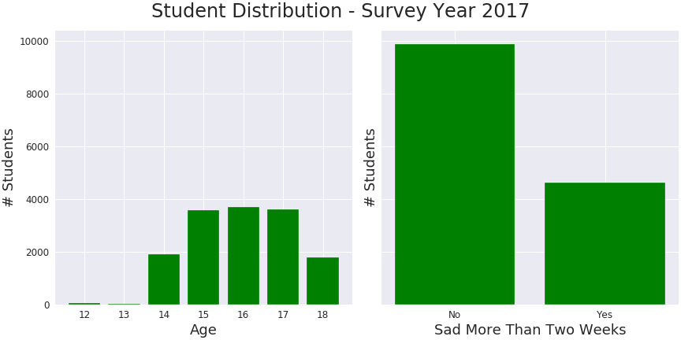
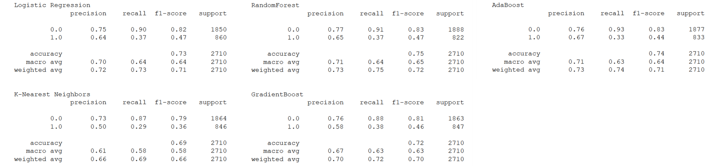
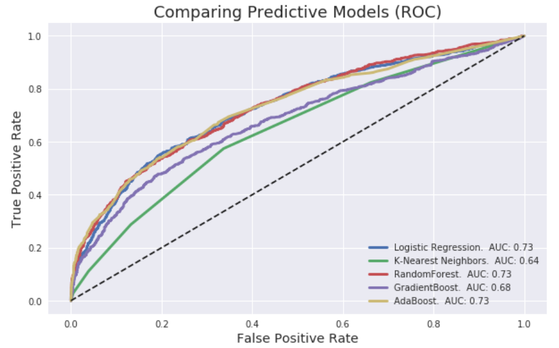
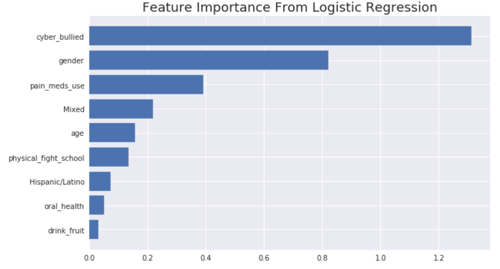
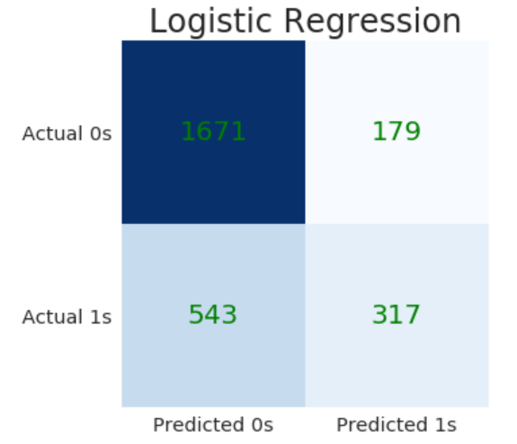
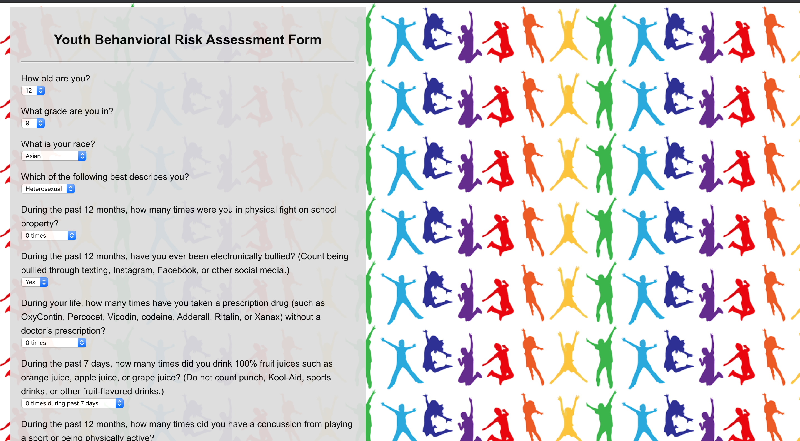

# Predicting Risk of Depression in Youth

  

## Motivation and Objective:

This project used machine learning models to predict youth behavior, specifically risk of depression as a function of various youth characteristics and other behavior. Models were derived from responses provided to a cross-sectional CDC survey on Youth Risk Behavior (YRBS). An interactive website was created using the best performing model to provide awareness on the topic to youth and their parents.

## Data Preparation & EDA:

The CDC's biennial survey on youth risk behavior began in 1991 on the national, state and district levels. This project only uses the national survey responses from youths attending school and ranging in age from 12 to 18 years old during 2017. The data was obtained from the [CDC](https://www.cdc.gov/healthyyouth/data/yrbs/data.htm) and loaded into a pandas dataframe for data cleaning and preparation.

The more than 100 questions are categorized into student demographics and areas of risk including, but not limited to Unintentional Injuries and Violence, Electronic Vapor Product Use, Alcohol and Other Drug Use, Dietary Behaviors and Physical Inactivity.

The target is the binary response to question:

“During the past 12 months, did you ever feel so sad or hopeless almost every day for two weeks or more in a row that you stopped doing some usual activities?”

This response was codified such that Yes is 1 and No is 0.

Each category in the CDC survey questions included redundancy to assess consistency among student responses. Redundant questions were removed to minimize collinearity in the features. Additional steps to clean the data are addressed in the [clean_data helper function](src/helpers.py) 

Simple correlations and visualizations were made to gain a cursory understanding of the data.

  

The number of students decreased going from 9th to 12th grade; this may be due to some students failing to progress  to the next grade level. There were slightly more female than male students (approximately 7500 to 7100, respectively). Most youths identify as 'White' followed by 'Hispanic/Latino', 'Black' and 'Mixed' race. Students also identify as heterosexual more than all three remaining options combined--bisexual, note sure and homosexual.

  

Finally, the majority of the students in this subset of the survey ranged in age from 15 to 17 years old. These students were also more likely to have provided a "No" response (approximately 70%) to the target question suggesting a mild class imbalance exists.

  

## Models:

A classifier was built using machine learning techniques and evaluated according to its precision, recall, receiver operating characteristics and a confusion matrix to assess false negatives.

Models to predict the probability a youth was 'sad' for more than two weeks in the last year were made using logistic regression, k-nearest neighbors, random forest classification, gradient boost classification and ada boost classification.

## TAKEAWAYS:

COMPARE MODELS

  

ADD IMPROVED METRICS TABLE USING BEST MODEL. DISCUSS ADJUSTMENTS TO MAKE IMPROVEMENTS. 

COMPARE MODELS

  

COMPARE MODELS

  

COMPARE MODELS

  

DISCUSS FEATURE IMPORTANCE and DISCUSS ITS INCORPORATION INTO WEBSITE

FINISH MAKING WEBSITE

  

ADD LINK TO WEBSITE!

## Featured Notebooks/Analysis Files:
