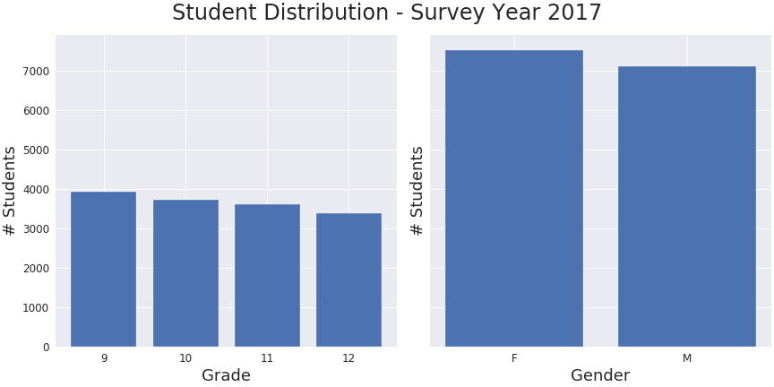
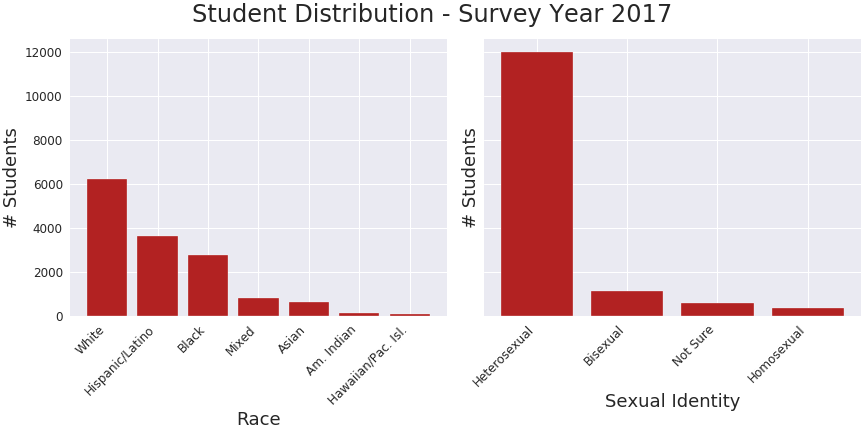

# Predicting Risk of Depression in Youth

  

## Motivation and Objective:

This project used machine learning models to predict youth behavior, specifically risk of depression as a function of various youth characteristics and other behavior. Models were derived from responses provided to a cross-sectional CDC survey on Youth Risk Behavior (YRBS). An interactive website was created using the best performing model to provide awareness on the topic to youth and their parents.

## Data Preparation & EDA:

The CDC's biennial survey on youth risk behavior began in 1991 on the national, state and district levels. This project only uses the national survey responses from youths attending school and ranging in age from 12 to 18 years old during 2017. The data was obtained from the [CDC](https://www.cdc.gov/healthyyouth/data/yrbs/data.htm) and loaded into a pandas dataframe for data cleaning and preparation.

The more than 100 questions are categorized into student demographics and areas of risk including, but not limited to Unintentional Injuries and Violence, Electronic Vapor Product Use, Alcohol and Other Drug Use, Dietary Behaviors and Physical Inactivity.

The target is the binary response to the question:

“During the past 12 months, did you ever feel so sad or hopeless almost every day for two weeks or more in a row that you stopped doing some usual activities?”

This response was codified such that Yes is 1 and No is 0.

Each category in the CDC survey questions included redundancy to assess consistency among student responses. Redundant questions were removed to minimize collinearity in the features. Additional steps to clean the data are addressed in the [clean_data helper function](src/helpers.py) 

Simple correlations and visualizations were made to gain a cursory understanding of the data.

  

The number of students decreased going from 9th to 12th grade; this may be due to some students failing to progress  to the next grade level. There were slightly more female than male students (approximately 7500 to 7100, respectively). Most youths identify as 'White' followed by 'Hispanic/Latino', 'Black' and 'Mixed' race. Students also identify as heterosexual more than all three remaining options combined--bisexual, note sure and homosexual.

  

Finally, the majority of the students in this subset of the survey ranged in age from 15 to 17 years old. These students were also more likely to have provided a "No" response (approximately 70%) to the target question suggesting a mild class imbalance exists.

  

## Models:

A classifier was built using machine learning techniques and evaluated according to its precision, recall, receiver operating characteristics and a confusion matrix to assess false negatives.

Models to predict the probability a youth was 'sad' for more than two weeks in the last year were made using logistic regression, k-nearest neighbors, random forest classification, gradient boost classification and ada boost classification.  Hyperparameter tuning with 5- and 10-fold cross validation to optimize the random forest and gradient boosting models. 

## TAKEAWAYS:

COMPARE METRICS MODELS

  

A receiver operating characteristics (ROC) curve, where true positive rates are plotted on the y-axis and false positive rates are plotted on the x-axis, was generated for all five models considered in this study. The shape of the curve for all models is consistent with what is expected for real-world binary classifiers.

To measure the performance of each classifier, areas under the curve (AUC) were calculated.

- Models with an AUC of 1.0 are always correct. 
- Models with an AUC of 0.0 are always incorrect.
- Models with an AUC of 0.5 have a predictive ability equivalent to random guessing.

Of the five classifiers, k-nearest neighbors performs the worst with an AUC of 0.6. The logistic regression, random forest and ada boost classifiers all have an AUC of 0.73. Of these three models, the coefficients calculated with logistic regression can be used to explain the significance of the features (independent variables) used in the model.

  

Taking a closer look at the features shows that cyber-bullying is significant in determining risk of depression. To a lesser degree, gender and use of prescription pain medication are also significant. The appearance of oral_health in the features graph below is consistent with students with depression experiencing a decline in oral health or personal hygiene (Little JW. Dental implications of mood disorders. Gen Dent. 2004; 52(5): 442–450). In contrast, the presence of drink_fruit, was not expected.  

  

A confusion matrix was generated from the logistic regression model. While the number of true positives (lower-right) and true negatives (upper-left) showed promise, the large number of false negatives are a cause for concern as this model should not predict youths at risk for depression as healthy since these are the youths that need assistance.

  

## GOING FORWARD:

The model can be improved upon to take into account the minor class imbalance in the data. Also, decreasing the number of false negatives is necessary.

I am also interested in creating an interactive website where a concerned parent or youth can gain insight into their risk for depression by answering a series of questions on a web form. A mockup of the website is shown below.

  

WEBSITE COMING IN THE FUTURE!

## Featured Notebooks/Analysis Files:
- src/helpers.py: file containing functions for data wrangling
- src/org_mods.py: file containing functions to execute various statistical and machine learning models
- src/predictions.py: file to be used with upcoming website to predict risk for depression

- notebook/nation_features.ipynb: jupyter notebook containing images shown in ReadME and more... still under-construction. The notebook loaded is not the finished product.

